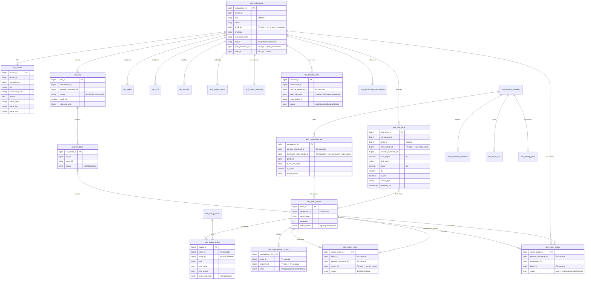
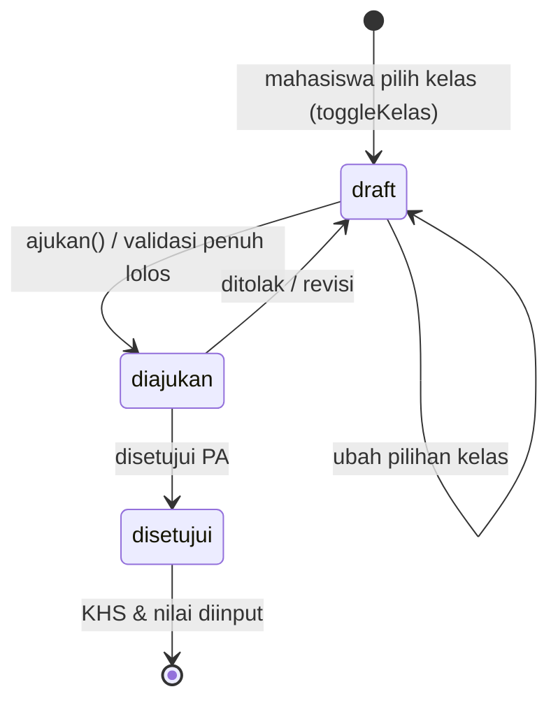
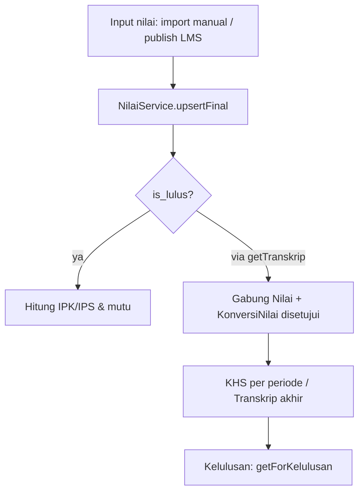
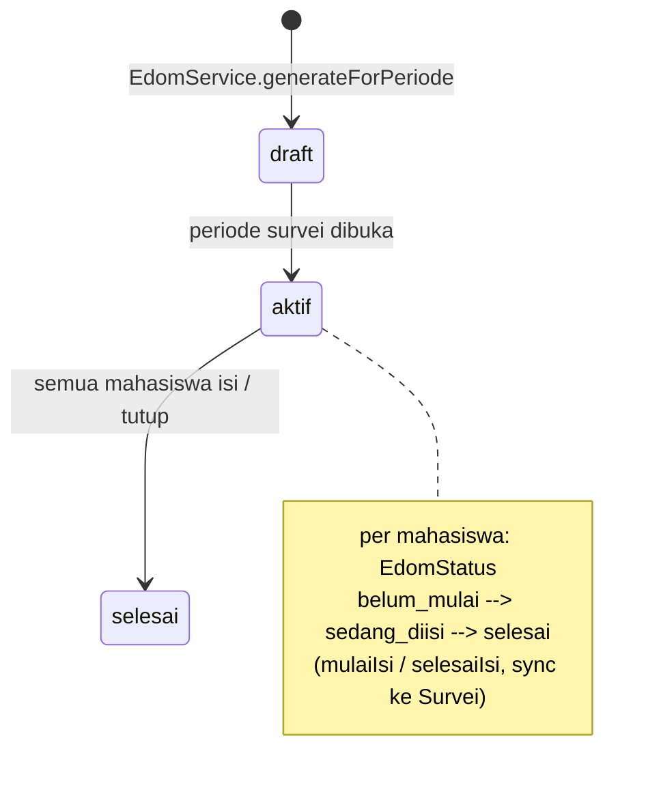

# Akademik — Domain

Modul Akademik adalah modul **operasi akademik & siklus hidup mahasiswa** yang mencakup data mahasiswa & biodata, tahun ajaran & periode akademik, kalender akademik, KRS (Kartu Rencana Studi), penawaran & kelas & jadwal kuliah, pembebanan dosen, pembimbing, input nilai (KHS/transkrip), konversi/rekognisi nilai, batas SKS, cekal/cuti/transfer, riwayat status, status semester, publikasi kurikulum, serta EDOM (Evaluasi Dosen Oleh Mahasiswa). Modul ini dibangun di atas data kurikulum dari modul **Kurikulum** dan menerima mahasiswa yang dipublikasikan dari modul **Pmb**.

> Module: `akademik` | Alias: `akademik` | Group portal: `academic` | Priority: 9 (module.json) / 70 (portal) | Prefix route: `/akd`
> Operasi akademik & siklus hidup mahasiswa — KRS, nilai, penawaran, jadwal, perkuliahan.

## Identitas & Metadata

| Field | Value |
|---|---|
| name | `Akademik` |
| alias / route_prefix | `akademik` → `/akd` |
| portal.group | `academic` |
| portal.priority | 70 |
| portal.icon | `clipboard-check` |
| portal.status | `ready` |
| portal.route | `akd.dashboard` |
| portal.description | Operasi akademik & siklus hidup mahasiswa — KRS, nilai, penawaran, jadwal, perkuliahan |
| priority (boot) | 9 |
| requires | `Account`, `HrCore`, `Sys`, `Kurikulum`, `Pmb`, `Referensi` |
| DB connection | default tenant connection (tidak ada koneksi DB khusus; semua tabel di schema tenant aktif) |

## Dependencies

- **Account** — user identity (`user_id`), tenant scope (`sys_tenant_id()`).
- **HrCore** — `hr_struktur_organisasi.orgunit_id` (prodi), `hr_pegawai.pegawai_id` (dosen pengampu/pembimbing).
- **Kurikulum** — `kur_kurikulum_mata_kuliah.kur_mk_id` (FK penawaran), `kur_mata_kuliah.mata_kuliah_id` (nilai/prasyarat), `kur_prasyarat_mata_kuliah` (validasi KRS), `SettingProdiService` (binding kurikulum per angkatan).
- **Pmb** — bridge pendaftaran (`pmb_pendaftar_id` → `pmb_pendaftaran.pendaftaran_id`, FK logis tanpa constraint).
- **Referensi** — `sys_refs` untuk referensi umum.
- **Sys** — periode bersama, media (`sys_media_url` / `sys_storage_url`).
- **Survei** (cross-module, FK logis) — `akd_edom_kelas.survei_id` → `survei_survei.survei_id`.

Modul lain yang bergantung pada Akademik: **Pmb** (publish mahasiswa via `MahasiswaService::createFromPmb`), **Kemahasiswaan** (`kmhs_*.mahasiswa_id` → `akd_mahasiswa.mahasiswa_id`), **Kelulusan** (`lulus_yudisium.mahasiswa_id`, `NilaiService::getForKelulusan`, `MahasiswaService::isCekal`).

## Daftar Tabel & Model

| # | Tabel | Model | Connection | Key columns / description |
|---|-------|-------|-----------|---------------------------|
| 1 | `akd_mahasiswa` | `Mahasiswa` | default | `nim` UNIQUE, `nama`, `prodi_id` (FK logis → hr_struktur_organisasi), `angkatan`, `kurikulum_kode`, `status` (aktif/cuti/lulus/do/keluar), `jenis_masuk`, `pmb_pendaftar_id`, `user_id`. Master mahasiswa aktif. |
| 2 | `akd_biodata` | `Biodata` | default | `mahasiswa_id` (index), data identitas + alamat (provinsi/kabupaten/kecamatan/kelurahan + kode wilayah), ayah/ibu/wali, socio-economic. ~50 kolom, no FK. |
| 3 | `akd_tahun_ajaran` | `TahunAjaran` | default | `nama`, `tahun_mulai`, `tahun_selesai`, `is_aktif`. |
| 4 | `akd_periode_akademik` | `PeriodeAkademik` | default | `nama`, `semester` enum (ganjil/genap/pendek), `tgl_mulai`, `tgl_selesai`, `is_aktif`. Induk penawaran/kalender/batas SKS. |
| 5 | `akd_kalender_akademik` | `KalenderAkademik` | default | `periode_akademik_id` (FK cascade), `nama_kegiatan`, `jenis` enum (akademik/ujian/libur/lainnya/krs/edom), `metadata` JSON (filter prodi_id & angkatan untuk event `krs`). |
| 6 | `akd_ruang_kuliah` | `RuangKuliah` | default | `kode` UNIQUE per tenant, `nama`, `gedung`, `lantai`, `kapasitas`, `jenis` enum (kelas/lab/aula/online). |
| 7 | `akd_batas_sks` | `BatasSks` | default | `periode_akademik_id` (FK cascade), `ipk_min`, `ipk_max`, `max_sks`. Lookup `getBatasByIpk()`. |
| 8 | `akd_penawaran_mk` | `PenawaranMataKuliah` | default | `periode_akademik_id` (FK cascade), `kurikulum_mata_kuliah_id` (FK → `kur_kurikulum_mata_kuliah` cascade), `prodi_id`, `kurikulum_kode`, `is_wajib`, `grup_pilihan`, `sistem_kuliah`, `is_aktif`. |
| 9 | `akd_kelas_kuliah` | `KelasKuliah` | default | `penawaran_id` (FK cascade), `ref_kelas_id`, `nama_kelas`, `kapasitas`, `sistem_kuliah` enum (reguler/online/hybrid). |
| 10 | `akd_jadwal_kuliah` | `JadwalKuliah` | default | `kelas_id` (FK cascade), `ruang_id` (FK nullOnDelete), `hari` enum, `jam_mulai`, `jam_selesai`, `jenis_pertemuan` enum (teori/praktikum), `link_online`. |
| 11 | `akd_pembebanan_dosen` | `PembebananDosen` | default | `kelas_id` (FK cascade), `pegawai_id` (FK logis → hr_pegawai), `peran` enum (pengampu/asisten/koordinator). |
| 12 | `akd_pembimbing_mahasiswa` | `PembimbingMahasiswa` | default | PK `pma_id`, `periode_akademik_id` (FK cascade), `pegawai_id`, `mahasiswa_id`, `jenis_pembimbing` (ref). |
| 13 | `akd_krs` | `Krs` | default | `mahasiswa_id`, `periode_akademik_id`, `status` (draft/diajukan/disetujui), `total_sks`, `disetujui_oleh`, `tgl_disetujui`, `catatan`. |
| 14 | `akd_krs_detail` | `KrsDetail` | default | `krs_id`, `kelas_id`, `status` (aktif/dibatalkan). 1 KRS → banyak detail kelas. |
| 15 | `akd_nilai_akhir` | `Nilai` | default | `mahasiswa_id`, `kelas_id` nullable, `mata_kuliah_id` (FK logis → kur_mata_kuliah), `periode_akademik_id`, `nilai_angka`, `nilai_huruf`, `bobot`, `sks`, `is_lulus`, `source_type`, `source_reference`, `published_at`. |
| 16 | `akd_konversi_nilai` | `KonversiNilai` | default | `mahasiswa_id`, `periode_akademik_id` (FK cascade), `jenis_rekognisi` enum (transfer/rpl/pindahan/pertukaran), `mata_kuliah_asal`, `mata_kuliah_id`, `status` enum (draft/diajukan/disetujui/ditolak). |
| 17 | `akd_cekal` | `Cekal` | default | `mahasiswa_id`, `jenis`, `alasan`, `tgl_mulai`, `tgl_selesai`, `is_aktif`, `dicabut_oleh`. |
| 18 | `akd_cuti` | `Cuti` | default | `mahasiswa_id`, `periode_akademik_id`, `alasan`, `status`, `disetujui_oleh`. |
| 19 | `akd_transfer` | `Transfer` | default | `mahasiswa_id`, `jenis`, `institusi_asal`, `prodi_asal`, `prodi_tujuan_id`, `sks_diakui`, `semester_diakui`, `status`. |
| 20 | `akd_riwayat_status` | `RiwayatStatus` | default | `mahasiswa_id`, `status_lama`, `status_baru`, `alasan`, `tgl_efektif`, `diproses_oleh`. |
| 21 | `akd_status_semester` | `StatusSemester` | default | `mahasiswa_id`, `periode_akademik_id`, `status`, `semester_ke`. |
| 22 | `akd_setting_prodi` | — (no dedicated Eloquent model; diakses via raw/service) | default | `periode_akademik_id`, `prodi_id`, `kurikulum_id`, `kurikulum_kode`, `buka_krs`, `tgl_krs_mulai/selesai`, `buka_khs`, `buka_pengisian_nilai`, `min_presensi_uts/uas`, `jumlah_pertemuan`, `angkatan` JSON. UNIQUE (tenant, periode, prodi). |
| 23 | `akd_publish_batch` | `PublishBatch` | default | `source_module`, `reference_code` UNIQUE, `total_data`, `success_count`, `conflict_count`, `metadata`. Log publikasi dari Kurikulum. |
| 24 | `akd_edom_kelas` | `EdomKelas` | default | `kelas_id` (FK cascade), `periode_akademik_id` (FK cascade), `survei_id` (FK logis → survei_survei), `tgl_mulai`, `tgl_selesai`, `status` enum (draft/aktif/selesai). UNIQUE (tenant, kelas, periode). |
| 25 | `akd_edom_status` | `EdomStatus` | default | `periode_akademik_id` (FK cascade), `mahasiswa_id`, `kelas_id` (FK cascade), `survei_pengisian_id` (FK logis), `status` enum (belum_mulai/sedang_diisi/selesai). UNIQUE (tenant, periode, mahasiswa, kelas). |

## Entity Relationship Diagram

> Views: `view_ap_rekap_beban_dosen` — rekap total SKS dosen per periode (join pembebanan → kelas → penawaran → kurikulum_mk → mata_kuliah). Bukan tabel; dikecualikan dari mutasi langsung.

## Relasi ke Modul Lain

- `akd_mahasiswa.prodi_id` → `hr_struktur_organisasi.orgunit_id` (HrCore) — prodi mahasiswa (FK logis).
- `akd_mahasiswa.pmb_pendaftar_id` → `pmb_pendaftaran.pendaftaran_id` (Pmb) — bridge ke data pendaftaran awal (FK logis).
- `akd_mahasiswa.user_id` → `users.id` (Account) — akun login mahasiswa (FK logis).
- `akd_penawaran_mk.kurikulum_mata_kuliah_id` → `kur_kurikulum_mata_kuliah.kur_mk_id` (Kurikulum) — **FK cascade**.
- `akd_nilai_akhir.mata_kuliah_id` → `kur_mata_kuliah.mata_kuliah_id` (Kurikulum) — FK logis.
- `akd_pembebanan_dosen.pegawai_id` / `akd_pembimbing_mahasiswa.pegawai_id` → `hr_pegawai.pegawai_id` (HrCore) — FK logis.
- `akd_edom_kelas.survei_id` → `survei_survei.survei_id` (Survei) — FK logis, tidak ada constraint.
- Layanan lintas modul: `MahasiswaService::createFromPmb()` (dipanggil Pmb), `NilaiService::getForKelulusan()/hitungIpk()` (dipanggil Kelulusan), `MahasiswaService::isCekal()` (dipanggil Kelulusan & Kemahasiswaan), `Kurikulum\SettingProdiService::getKurikulumForAngkatan()` (dipanggil Pmb).

Semua relasi di-scoped per `tenant_id` (multi-tenant).

## Arsitektur & Services

Struktur direktori:
- `app/Models/*` — 24 model Eloquent (setiap tabel memiliki model, kecuali `akd_setting_prodi` yang diakses via service/raw).
- `app/Services/*` — **fat service** (pola konsisten: `getBaseQuery()`, `getFilteredQuery()`, `getAll()`, `findById()`, `create()`, `update()`, `delete()` + metode domain).
- `app/Http/Controllers/*` — **thin controller**: hanya validasi request & delegasi ke service, tidak ada logika bisnis.
- `app/Http/Requests/*` — FormRequest terpisah per aksi.
- `app/Providers/AkademikServiceProvider.php` — registrasi route, view, policy.

Daftar fat-service & tanggung jawab utama:
- **MahasiswaService** — CRUD mahasiswa, `createFromPmb()` (cross-module bridge dari Pmb), `isCekal()`, `isCutiAktif()`.
- **BiodataService** — CRUD biodata mahasiswa.
- **TahunAjaranService / PeriodeAkademikService / KalenderAkademikService** — master waktu akademik; kalender memicu event `krs`/`edom`.
- **PenawaranService / GeneratePenawaranService** — penawaran MK; `generate()` membangun penawaran dari Kurikulum (`KurikulumService`) per periode & prodi.
- **KelasKuliahService** — CRUD kelas + `createWithRelations()` (pembebanan & jadwal), `existsDosenConflict()`.
- **JadwalKuliahService** — CRUD jadwal, `checkOverlap()`, `findConflicts()`.
- **PembebananService / PembebananMahasiswaService / PembimbingMahasiswaService / PembimbingMahasiswaImportService** — dosen pengampu & pembimbing.
- **RuangKuliahService** — master ruang.
- **KrsService** — **inti KRS**: validasi penuh (cekal/cuti, jendela KRS, kuota, batas SKS, prasyarat via `Kurikulum\PrasyaratMataKuliah`, bentrok jadwal), `toggleKelas()`, `ajukan()` (draft→diajukan), `getMonitoring()`.
- **NilaiService** — `upsertFinal()` (import/LMS), `getKhs()`, `getTranskrip()` (gabung nilai + rekognisi), `hitungIpk()/hitungIps()`, `hasLulusPrasyarat()`.
- **NilaiImportService / MahasiswaImportService** — impor Excel berbasis batch (draft→review→commit).
- **BatasSksService** — `getBatasByIpk()` lookup batas SKS.
- **RekognisiService** — `getApprovedForTranskrip()` (konversi nilai disetujui masuk transkrip).
- **MataKuliahService** — pencarian MK untuk Select2 (via Kurikulum).
- **CekalService / CutiService / TransferService / RiwayatStatusService / StatusSemesterService** — status & riwayat mahasiswa.
- **EdomService** — `generateForPeriode()`, `mulaiIsi()/selesaiIsi()`, `getRekapByKelas()`, sinkronisasi ke modul Survei.
- **DashboardService** — statistik admin & mahasiswa.

Tidak ada interface/contract khusus di modul ini (service saling di-inject via constructor).

## Alur Bisnis / Domain Flows

### KRS Lifecycle (stateDiagram)

Aturan validasi `KrsService::validateKrs()`:
1. Tolak bila mahasiswa **cekal** atau **cuti aktif** di periode tsb.
2. Jendela KRS harus terbuka (`akd_kalender_akademik` jenis=`krs`, now dalam range, prodi & angkatan cocok dengan `metadata`).
3. Semua kelas harus dari `penawaran_mk` periode yang sama; 1 MK = 1 kelas; tidak boleh dobel enroll.
4. Kuota kelas tidak boleh lewat kapasitas.
5. `total_sks ≤ getBatasByIpk(ipk, periode)` (`akd_batas_sks`).
6. Prasyarat MK (`kur_prasyarat_mata_kuliah`) harus lulus (`hasLulusPrasyarat`).
7. Tidak boleh bentrok jadwal (hari & jam, kelas non-online).

### Nilai / KHS / Transkrip Lifecycle (flowchart)

- `source_type`: `import_manual` / `publish_lms`. `published_at` menandai nilai sudah terbit (KHS).
- Transkrip = nilai lulus + `KonversiNilai` berstatus `disetujui` (`RekognisiService::getApprovedForTranskrip`).

### EDOM Lifecycle (stateDiagram)

### Siklus Status Mahasiswa
`Mahasiswa` → `RiwayatStatus` (setiap perubahan `status`), `StatusSemester` (per periode), `Cekal`/`Cuti`/`Transfer` (pengecualian). Mahasiswa yang lulus diproses di modul **Kelulusan** (status diubah jadi `lulus` oleh `YudisiumService::approve`).

## Catatan Domain

- **Mahasiswa bridge ke Pmb**: `akd_mahasiswa.pmb_pendaftar_id` adalah FK logis ke `pmb_pendaftaran`. Mahasiswa dibuat lewat `MahasiswaService::createFromPmb()` yang dipanggil oleh `Pmb\PublishMahasiswaService`.
- **Prodi = orgunit**: semua referensi prodi pakai `orgunit_id` dari `hr_struktur_organisasi` (HrCore).
- **`akd_setting_prodi` tanpa model dedicated**: tabel ada (migrasi) untuk jendela buka KRS/KHS/nilai & min presensi per prodi-periode; namun tidak ada `SettingProdi.php` model di Akademik — diakses via raw query / `Kurikulum\SettingProdiService` untuk binding kurikulum.
- **Unique constraints**: `akd_mahasiswa.nim`; `akd_ruang_kuliah.(tenant_id,kode)`; `akd_setting_prodi.(tenant_id,periode_akademik_id,prodi_id)`; `akd_edom_kelas.(tenant_id,kelas_id,periode_akademik_id)`; `akd_edom_status.(tenant_id,periode_akademik_id,mahasiswa_id,kelas_id)`; `akd_publish_batch.reference_code`.
- **Cascade delete**: `periode_akademik → penawaran → kelas → jadwal/pembebanan`; `kelas → edom_kelas/edom_status`. Hati-hati menghapus periode akan menghapus seluruh turunan.
- **Soft delete + blameable**: semua tabel pakai `softDeletes()` dan kolom `created_by/updated_by/deleted_by` + `id` terkait (`addStandardColumns`/`BaseMigration`).
- **EDOM cross-module**: `akd_edom_kelas.survei_id` FK logis ke modul Survei (tanpa constraint). Status pengisian disinkronkan dua arah (`syncDariSurvei`).
- **Batasan SKS dinamis**: `BatasSksService::getBatasByIpk()` memetakan IPK ke `max_sks` lewat rentang `ipk_min..ipk_max`.
- **Media & keamanan**: foto mahasiswa/biodata & bukti dokumen harus diakses via `sys_media_url()` / `sys_storage_url()` — **tidak ada symlink public** ke storage. Akses halaman & aksi dilindungi `can()` / `hasRole()` (RBAC).
- **Multi-tenant**: seluruh query di-scoped `tenant_id`; controller/service memanggil `sys_tenant_id()`.
